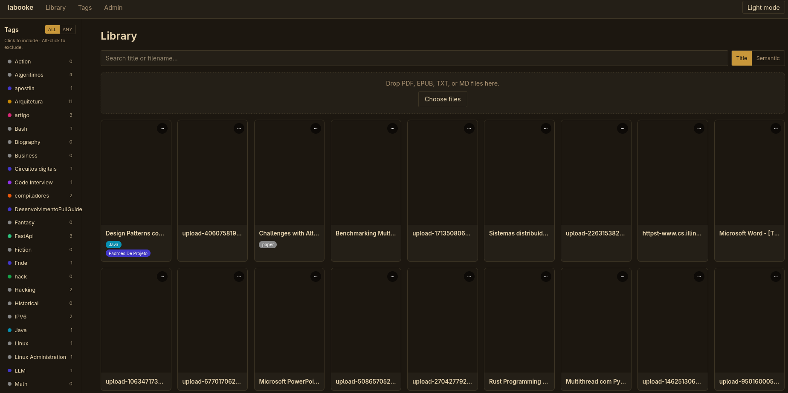
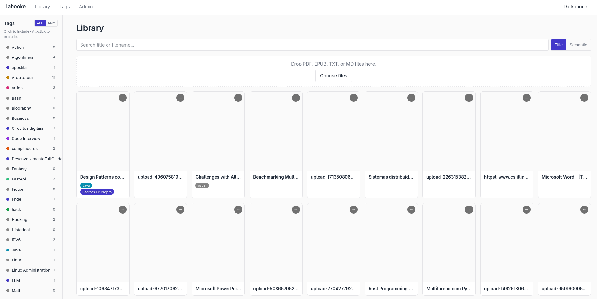
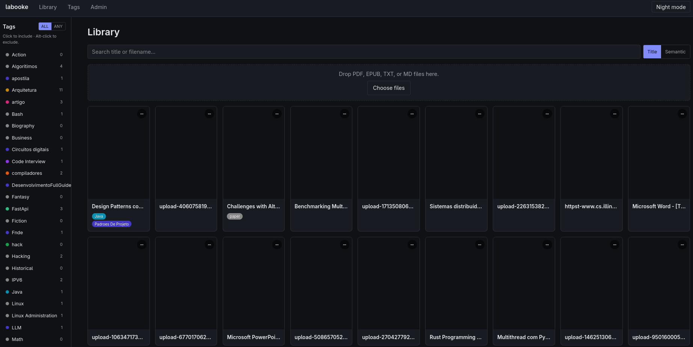
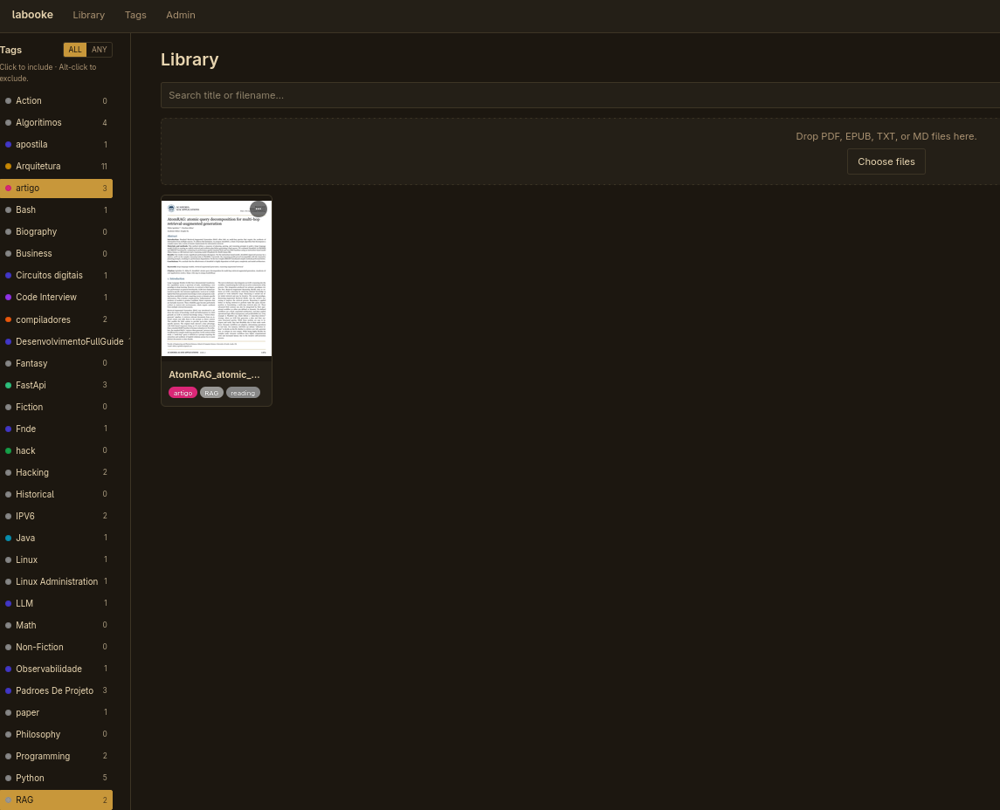
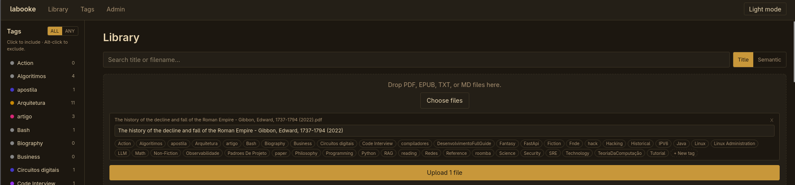
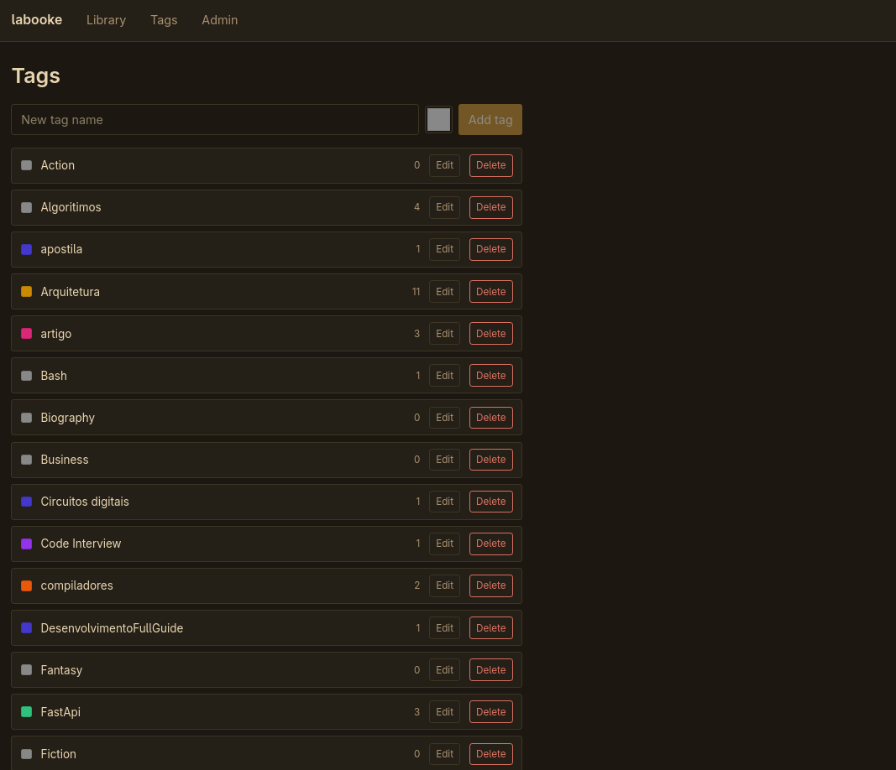
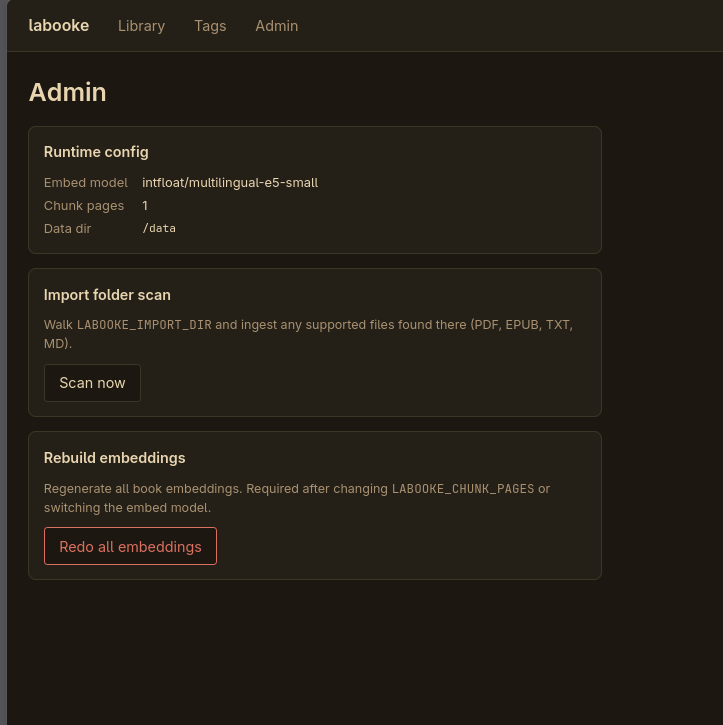

# labooke

Biblioteca pessoal de livros auto-hospedada. PDF, EPUB, TXT, MD.  
Tag-first, busca semântica, leitor integrado. Standby < 175 MB.



## Início rápido

```bash
cp .env.example .env
docker compose up --build -d
open http://localhost:8080
```

## Telas

### Biblioteca

Grid de livros, sidebar de tags (ALL/ANY, click inclui · alt-click exclui),
busca por título ou semântica. Três temas: Light, Dark, Night.

| Light | Dark | Night |
|-------|------|-------|
|  |  |  |

### Filtro por tag

Click numa tag filtra o grid. Contadores por tag na sidebar.



### Upload

Arrasta PDF/EPUB/TXT/MD ou escolhe arquivos. Edita título e tags antes de ingerir.



### Tags

CRUD de tags com cor e contador de livros. Merge de tags.



### Admin

Config de runtime, scan da pasta de import, rebuild de embeddings.



### Bible (CLI/TUI)

Busca e navegação da biblioteca pelo terminal.


## Documentação

| Arquivo                            | Conteúdo                              |
|------------------------------------|---------------------------------------|
| [docs/overview.md](docs/overview.md)   | Visão geral, stack, fluxo         |
| [docs/running.md](docs/running.md)     | Docker, dev local, testes         |
| [docs/upload.md](docs/upload.md)       | Upload de livros e ingestão       |
| [docs/reader.md](docs/reader.md)       | Leitor, tela cheia, bookmarks     |
| [docs/search.md](docs/search.md)       | Busca por título, semântica, tags |
| [docs/api.md](docs/api.md)             | Endpoints HTTP                    |
| [docs/frontend.md](docs/frontend.md)   | Estrutura do frontend             |
| [docs/docker.md](docs/docker.md)       | Docker, env vars, RAM             |
| [docs/bible.md](docs/bible.md)         | CLI bible: comandos, pager, lazy loading |
| [decisions/](decisions/README.md)      | Decisões de arquitetura (ADRs)    |
