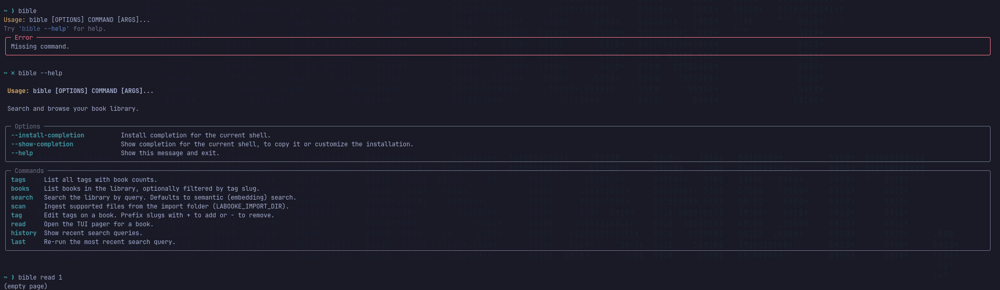

# bible CLI

Terminal client para o labooke. Acessa a biblioteca via HTTP (`LABOOKE_API_URL`,
padrão `http://localhost:8000`) — não conecta direto ao banco.



## Comandos

| Comando | O que faz |
|---|---|
| `bible books [--tag slug]` | Lista livros com ID, formato e tags |
| `bible tags` | Lista tags com contagem de livros |
| `bible search <query>` | Busca via LLM/ask (padrão) ou lexical (`--lexical`) |
| `bible read <id> [-p N]` | Abre o pager TUI na página N (padrão 1) |
| `bible tag <id> +slug -slug` | Adiciona/remove tags de um livro |
| `bible scan` | Dispara ingestão da pasta de import |
| `bible history [-n N]` | Mostra últimas N queries |
| `bible last` | Re-executa a busca mais recente |

## Carregamento de páginas (lazy)

O pager carrega **somente a página atual** via HTTP. Nenhum pré-carregamento.
Ao pressionar `n` ou `p`, o pager faz um novo request antes de renderizar.

```
bible read 15       # abre na página 1
bible read 15 -p 42 # abre diretamente na página 42
```

Consequência: há um pequeno delay a cada troca de página (roundtrip HTTP +
extração do PDF). Para leitura linear isso é perceptível. Melhoria futura:
cachear a página seguinte em background após cada carregamento.

## Teclas do pager

| Tecla | Ação |
|---|---|
| `n` / `p` | Próxima / anterior página |
| `j` / `k` | Scroll de linha |
| `g` / `G` | Primeira / última página |
| `/` | Busca no texto da página |
| `q` | Sair |

## Configuração

| Variável | Padrão | Descrição |
|---|---|---|
| `LABOOKE_API_URL` | `http://localhost:8000` | Endpoint da API |
| `LABOOKE_DATA_DIR` | `./data` | Diretório do histórico |

Exemplo para servidor remoto:
```bash
export LABOOKE_API_URL=http://meu-servidor:8000
bible books
```

## Histórico

Cada busca (`search` / `last`) é gravada em `$LABOOKE_DATA_DIR/bible_history.txt`.

`bible search` usa por padrão `GET /api/search?mode=hybrid`: KNN semântico
nos chunks dos livros + BM25, combinados por RRF. `--lexical` limita a busca
a título/filename. Os filtros de tag são aplicados no servidor. Esse fluxo
não requer LLM; a recomendação por descrições fica na interface web.

→ Ver [running.md](running.md) para como iniciar o servidor.
→ Ver [search.md](search.md) para detalhes dos modos de busca.
